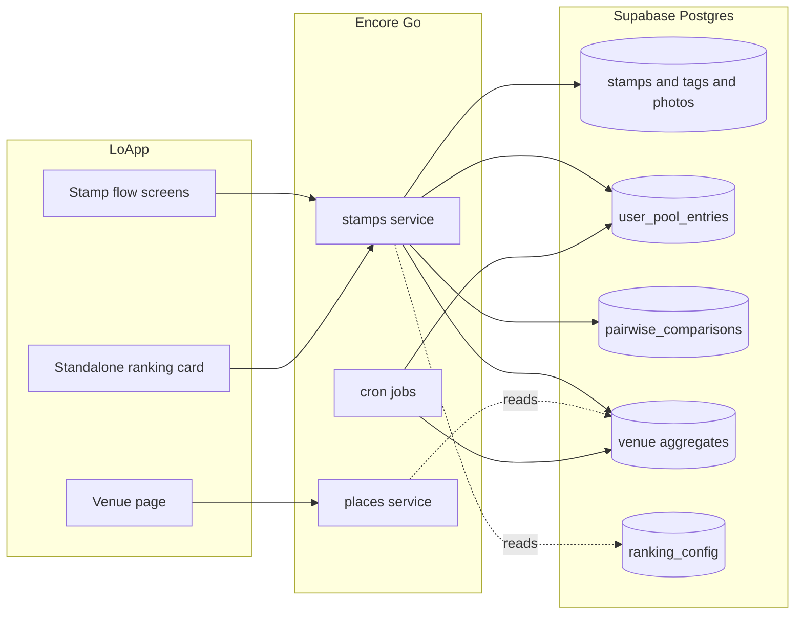
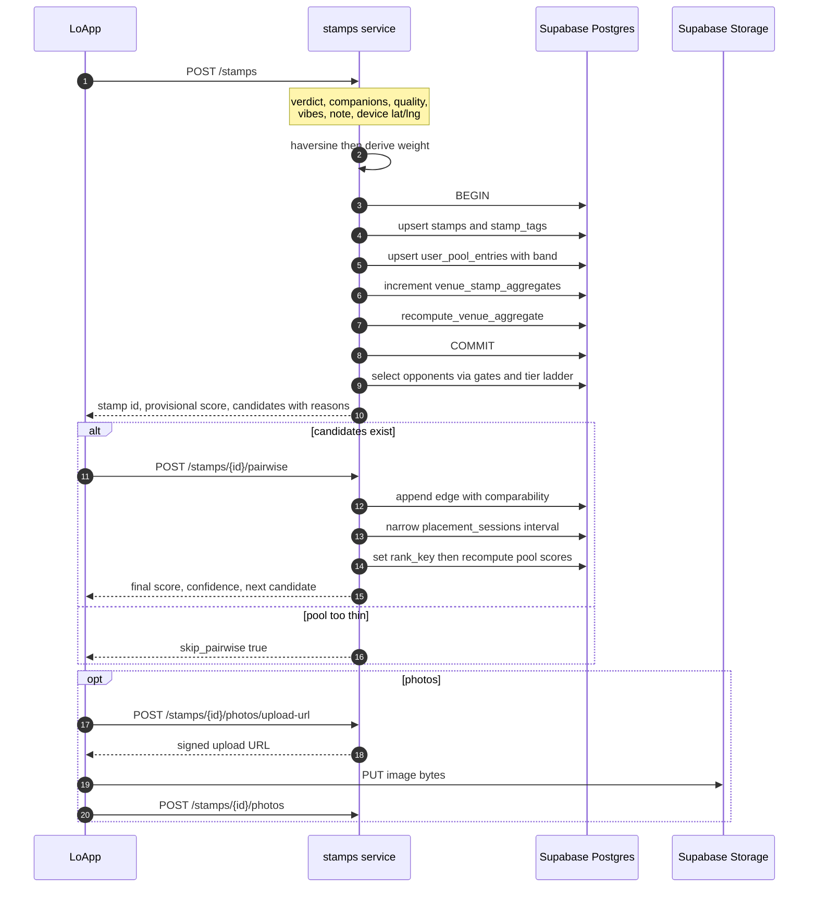
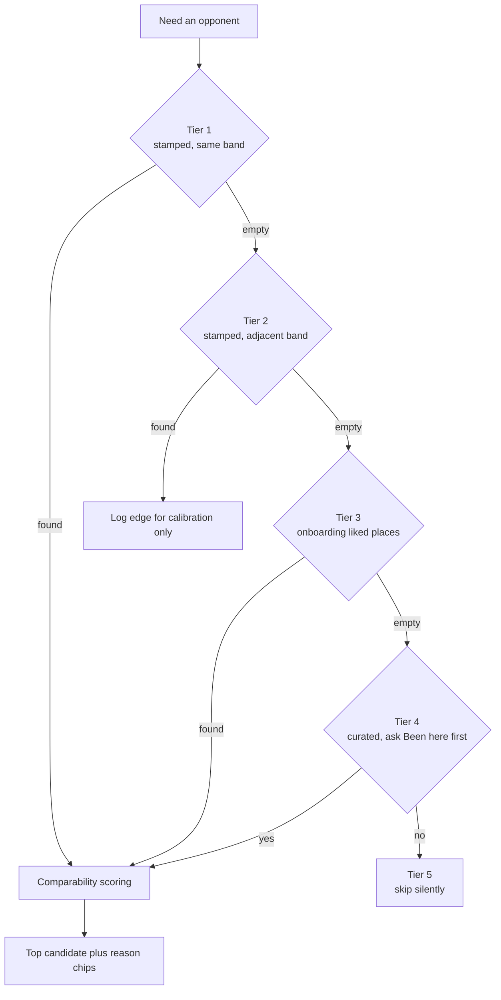
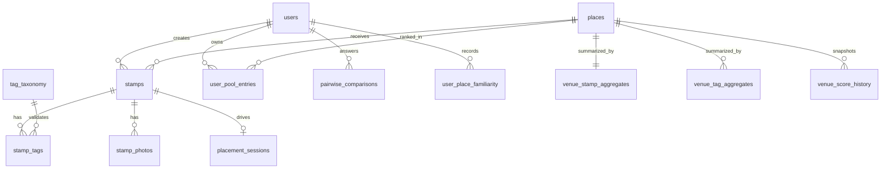

# Lo! Stamp & Ranking Backend — Design

**Product** Lo! — HCMC / Hanoi / Da Nang
**Scope** Backend architecture, ranking engine, pairwise comparison engine
**Stack** Encore.go on external Supabase Postgres, sqlc, Auth0
**Stage** Pre-MVP — empty stamp table, 5 curated venues, no rating history
**Status** Proposed

---

## 1. Executive summary

> The verdict on Step 1 answers *"which shelf does this go on?"* The pairwise on Step 3 answers *"where on that shelf?"* That split is the entire design.

The verdict is a coarse but extremely reliable signal collected from 100% of stampers in a single tap. The pairwise is a precise but expensive signal collected only sometimes. By making the verdict select a score *band* and the pairwise select a *position within that band*, a venue has a sane score after zero comparisons and a sharp one after a handful.

Critically, nothing in this system needs to know the population distribution. That is what makes it shippable against an empty database.

### The four design commitments

- **Algorithms whose correctness does not depend on sample size.** Banded binary-insertion is deterministic. A user's first-ever Must Repeat scores at the midpoint of `[7.0, 10.0]` because it sits alone in that band — not because of any statistic.
- **Two hard gates make pairwise fair.** Same sentiment band, and same venue archetype. The first ensures you only compare things you felt the same way about; the second ensures street food never gets pitched against fine dining.
- **Every tunable number lives in a database row, not in code.** Calibration is an `UPDATE` on `ranking_config`, not a redeploy.
- **Collect the data today that enables the statistics you cannot do today.** An append-only comparison log and a nightly score snapshot mean that in six months you can fit Bradley-Terry over a dataset that started accumulating on day one.

---

## 2. What exists today

| Area | Current state |
|---|---|
| **Backend** | Encore.go monorepo, app ID `loappbackend-a9f2`. Seven services: `auth`, `users`, `onboarding`, `places`, `lists`, `events`, `debug`. |
| **Database** | **External Supabase Postgres**, not Encore `sqldb`. Shared lazy `pgxpool` via `pkg/externaldb`. Queries in `db/queries/*.sql`, generated into `internal/dbgen` by sqlc. Migrations in `supabase/migrations/`, applied with `supabase db push`. |
| **Auth** | Auth0 OIDC. `auth.UID` is the internal `users.id` UUID, so new endpoints get user identity for free. |
| **Ranking** | None. The first migration carries the comment `-- Future: user_place_rankings (Beli head-to-head)`. This design fills that slot. |
| **Pub/Sub** | None anywhere in the codebase. |
| **Cron** | One job — daily curated-list sync in `lists/cron.go`. Pattern is established and reusable. |
| **Stamp UI** | Fully built: one screen, three steps plus success, in `src/screens/StampFlowScreen.tsx`. State is local `useState`. **It submits nowhere.** The pairwise opponent is a hardcoded constant. |
| **API client** | Hand-written `apiFetch` plus react-query. No generated Encore client. |

### Blocking prerequisite

**`places` has no canonical category or archetype.** Only the 5 curated places link to `purpose_categories` via `place_categories`; Google-sourced places carry only a humanized `tags[]`, and raw Google `types[]` are discarded at ingest. Since category and archetype are the first two gates of apples-to-apples comparison, this must be fixed before anything else is built.

### Two assets worth more than they look

- **`user_liked_places`** — populated during onboarding when users pick places they already know. A pre-seeded comparison pool that solves day-one cold start.
- **`user_follows`** — the social graph table already exists with no API on top. The friend-signal feature is closer than it appears.

---

## 3. The stamp flow

Three steps plus a success screen.

### Step 1 — the verdict

- **Overall Experience** — required, one pick from `must-repeat` / `good-pick` / `mid` / `not-for-me`. Layer 1. Selects the score band; the most load-bearing input in the system.
- **Who would you go with?** — optional, up to 3 from `family` / `squad` / `my-date` / `solo`. Layer 1. First pick stored as primary.
- **Quick note** — optional, 100 characters.

### Step 2 — the quality check

- **How was the food?** — required, one pick from `outstanding` / `good` / `okay` / `not-good`. **Layer 2.** This is the anti-vibe-inflation signal and carries 0.35 of the community composite.
- **Vibe tags** — optional, unlimited, custom tags allowed. Layer 1.
- **Photos** — optional, max 5, labelled `food_drink` / `space_vibe` / `other`.

### Step 3 — This or That

Optional. Server-selected opponent. Silently skipped when no comparable venue exists.

### Removed: "What's this best for?"

Three consequences, all accepted:

- **Occasion pods are dropped.** Contextual pods were fed by companions plus best-for. Companion-driven pods survive (date night, squad, solo, family); occasion pods — business lunch, quick bite, late-night eats, pre-game — have no input left. Decision: drop them rather than approximating from vibe tags, which would produce plausible-looking but unfounded placements.
- **Archetype inference loses a signal.** Tags like `fine-dining` were going to reinforce `venue_archetype`. Without them it must come from price level, Google types, and hand-seeded curated rows — which is why archetype moves to a Phase 0 deliverable.
- **The venue page loses a section.** `CommunityStamps` renders a four-quadrant chart whose fourth segment is `whats-best-for`, and `ReviewCard` renders a "Best For" chip row. Both need retiring rather than rendering empty.

Re-adding best-for later is cheap: `stamp_tags` uses a `tag_type` discriminator, so it is a `CHECK` constraint change plus taxonomy rows.

---

## 4. The three obstacles

### 4.1 No data for statistics

Standard deviation, k-means, percentile normalisation all need a population. You have none. The resolution is not to approximate them but to **choose algorithms that never needed them**.

- Personal scores come from banded binary-insertion, deterministic and defined at *n* = 1.
- Community scores use Bayesian shrinkage toward a flat per-category constant, well-defined at *n* = 0.
- Component weights adapt to data density: the pairwise term contributes nothing until a venue has enough comparisons to justify it, and its share redistributes automatically.
- A nightly `venue_score_history` snapshot begins accumulating distribution data *today*.

### 4.2 Apples-to-apples pairwise

Beli's weakness is comparing any restaurant to any restaurant — a street banh mi against a tasting menu. Two hard gates fix it.

**The sentiment band gate.** You only compare venues the user felt the same way about. This is not merely fairer, it is information-theoretically better: comparing a Must Repeat against a Not For Me has near-zero information content because the answer is already known. Comparing two Must Repeats sits at maximum entropy.

**The archetype gate.** Category alone is not enough, because `restaurant` contains both a banh mi cart and a hotel tasting menu. `venue_archetype` splits each category into divisions, and pairwise only happens inside a division.

> **Category chooses the sport. Archetype and price choose the division. Pairwise only happens inside the same division.**

Every candidate ships with a human-readable reason string so the fairness is **visible in the UI**. Beli cannot show you why it paired two places, because it does not know.

### 4.3 Thin venue and visit data

Opponent selection degrades through five tiers rather than failing. Tier 3 matters most: a brand-new user who picked 3–5 known places during onboarding can do a meaningful pairwise on their very first stamp, and a comparison against a liked-but-unstamped place bootstraps a provisional score for both venues at once.

---

## 5. Architecture



*One new service. Venue-page reads hit a pre-aggregated table, so the hot path stays a single indexed row read.*

### End-to-end submission



*Everything before the pairwise is one transaction. A user who force-quits after Step 2 still has a complete, scored stamp.*

**Why the pairwise is a second call.** The opponent must be chosen by the server, and the server cannot choose it until the verdict is known — the verdict determines the band, and the band determines the eligible pool. A single monolithic submit would make apples-to-apples impossible.

---

## 6. Layer 1 — the personal pool

Each user has one pool per venue category. The verdict selects a band; the pairwise binary-searches a position inside it.

| Verdict | Band | Meaning | Score at k = 1 |
|---|---|---|---|
| `must-repeat` | `[7.0, 10.0]` | Would go back without hesitation | 8.5 |
| `good-pick` | `[4.5, 7.0)` | Solid, would recommend | 5.8 |
| `mid` | `[2.5, 4.5)` | Fine, unremarkable | 3.5 |
| `not-for-me` | `[0.0, 2.5)` | Would not return | 1.3 |

### The score formula

```
s     = clamp( E_band / (k * log2(k+1)), 0.40, 1.00 )

score = lo + (hi - lo) * [ 0.5 + s * (i - (k+1)/2) / max(k, 8) ]
```

For `k >= 8` this reduces algebraically to exactly `(i - 0.5)/k`, the **Hazen plotting position** — a standard order-statistic estimator. The `max(k, 8)` floor is a small-sample stabiliser: early pools stay centred on the band midpoint and fan outward as they grow.

**Why the stabiliser matters.** Without it, every insertion re-scores the whole band aggressively:

| | position 3 of 3 | position 3 of 4 | drift |
|---|---|---|---|
| Plain Hazen | 9.5 | 8.875 | −0.625 |
| With `max(k, 8)` | 8.875 | 8.6875 | **−0.19** |

A user should not see a place they love silently lose six-tenths of a point because of something they did to a different venue.

**Why linear spacing at all?** With one to three comparisons per venue you can recover *order* but not *distance*. Given ordinal-only information, uniform spacing is the maximum-entropy choice — any other spacing injects information you do not possess. It is the correct small-*n* limit of the general case; once you can fit Bradley-Terry, you replace uniform spacing with estimated latent gaps.

### The placement evidence ratio `s`

`s` answers *"how much do we trust this ordering?"*

- `E_band` is the **sum of the comparability values** on that band's edges. A strong Tier 1 comparison counts as more evidence than a weak Tier 4 one.
- The denominator `k * log2(k+1)` comes from the comparison-sort bound: `log2(k+1)` comparisons to place one item, times `k` items to stabilise the whole shelf. It is an information-theoretic **budget**, not a closed-form proof.
- The `[0.40, 1.00]` clamp is a product default. The ceiling is definitional — a ratio of budget earned cannot exceed full trust. The floor guarantees a resolved comparison still produces a visible ~0.2-point gap instead of a near-tie.

Both bounds live in `ranking_config` and should be recalibrated from simulation and beta data.

### Properties this produces

Same band, eight venues, at two evidence levels:

| Position | `s = 0.40` (early) | `s = 1.0` (mature) |
|---|---|---|
| worst of 8 | 8.0 | **7.2** |
| 4th of 8 | 8.4 | 8.3 |
| best of 8 | 9.0 | **9.8** |

Early scores cluster near the band centre because you genuinely do not know the order yet. They fan out to fill the band as the user earns the resolution. The score is always an honest statement about how much the system actually knows.

### Ordering storage and confidence

- Position is held as a fractional `rank_key NUMERIC`. Inserting between neighbours is `(prev + next) / 2` and touches one row.
- A `placement_sessions` row holds the live binary-search interval `[lo, hi]`.
- `placement_confidence = comparisons_done / ceil(log2(k+1))` is the **work queue** feeding the standalone ranking card. This is how the comparison graph densifies without lengthening the stamp flow.
- A contradicting result never flips the pool. It appends an edge and increments `contradiction_count`; only at 3+ does the venue get re-placed. Pools always reorder silently.

---

## 7. Pairwise opponent selection

### 7.1 Hard gates

SQL `WHERE` clauses, not scores. A candidate is ineligible unless all pass.

1. **Same venue category** — never cross restaurant against bar
2. **Same city**
3. **Compatible `venue_archetype`** — kills street food versus fine dining
4. **Price level within one step**
5. **Same sentiment band** (Tier 1) or adjacent (Tier 2)
6. **Not compared recently**, and not the venue itself

If either side lacks an archetype and `|price delta| > 1`, do not offer the comparison. **A wrong pairing is worse than no pairing.**

### 7.2 Archetypes

| Category | Archetypes |
|---|---|
| `restaurant` | `street_food`, `casual`, `midrange`, `fine_dining` |
| `bar` | `cocktail_bar`, `craft_beer`, `pub`, `rooftop` |
| `cafe` | `specialty_coffee`, `study_cafe`, `chain` |
| `club` | `nightclub`, `live_music`, `lounge` |

Cold-start derivation, in priority order: hand-set for curated rows → Google `types[]` keywords → `price_level` bucketing (1 → street food or casual, 2 → casual or midrange, 3–4 → midrange or fine dining).

### 7.3 The tier ladder



| Tier | When it fires | What it does |
|---|---|---|
| **1** | User has stamped venues in this category with the same verdict | Best signal. Positions directly. |
| **2** | Only adjacent-band stamps exist | **Calibration only.** Two different bands occupy disjoint score ranges, so the head-to-head cannot order either one. The edge is logged for band-calibration telemetry and the future model; it never reorders. |
| **3** | No stamped peers; `user_liked_places` has same-category entries | Unbanded, so it gets pulled into the stamper's band and positioned. Bootstraps a provisional entry for the liked place. |
| **4** | Nothing above | Probe "Been to X?" against a curated venue. Answer persists in `user_place_familiarity` so it is asked at most once. |
| **5** | Nothing at all | Step 3 does not render. No error, no explanation. |

### 7.4 Comparability scoring

Because archetype is a **hard gate**, every survivor already matches on it — so it must not also carry soft weight, or it would be a constant contributing nothing to ranking. Weights go to the components that actually discriminate:

| Component | Weight | What it captures |
|---|---|---|
| Bisection proximity | 0.40 | Closeness to the binary-search midpoint. Maximises information gain per question. |
| Geographic proximity | 0.20 | Same neighbourhood full, same city partial. |
| Price proximity | 0.15 | Exact match full, one step apart halved. |
| Vibe tag Jaccard | 0.15 | Absorbs the weight formerly shared with best-for. |
| Visit recency | 0.10 | The user has to actually remember the place. |
| Staleness penalty | − | Subtracted per prior comparison of the same pair. |

The result is **persisted on the edge** and becomes that edge's contribution to `E_band`.

> **Comparability never enters the score arithmetic directly.** It selects *which question to ask*, and grades *how much to trust the answer*. The answer itself determines position `i`.

---

## 8. Worked example: Minh's first stamps

Minh is a brand-new user in Hanoi.

### Onboarding

He picks four places he knows. They land in `user_liked_places`. His bar pool has **zero stamps** but **three known bars**.

- Nê Cocktail Bar — Hoan Kiem, price 3, `cocktail_bar`
- Polite & Co — Ba Dinh, price 3, `cocktail_bar`
- Standing Bar — Tay Ho, price 2, `craft_beer`
- The Workshop Coffee — cafe *(wrong category, never eligible)*

### Stamp 1 — Summer Experiment

Cocktail bar, Hoan Kiem, price 3. Verdict **Must Repeat** → band `[7.0, 10.0]`. GPS within 140 m → weight **0.8**.

Tiers 1 and 2 are empty. Tier 3 runs the gates first:

- **Standing Bar is filtered out by the archetype gate** — `craft_beer` ≠ `cocktail_bar`. It is never scored and never shown.

Surviving candidates:

| Candidate | bisect .40 | geo .20 | price .15 | vibe .15 | recency .10 | total |
|---|---|---|---|---|---|---|
| **Nê Cocktail Bar** | .200 | .200 | .150 | .090 | .050 | **0.69** |
| Polite & Co | .200 | .080 | .150 | .075 | .050 | 0.56 |

Bisection is neutral for both because unbanded candidates have no pool position to be near. Nê wins on neighbourhood. The UI shows **"Both cocktail bars · Both Hoan Kiem · Same price range"**.

Minh prefers Summer Experiment. Nê is bootstrapped into the band below it.

```
k = 2,  E_band = 0.69,  needed = 2 * log2(3) = 3.17
s = clamp(0.218, 0.40, 1.00) = 0.40          <- floor, evidence is thin

Nê      i=1 -> 0.5 + 0.40*(-0.5/8) = 0.475 -> 7.0 + 1.425 = 8.4
Summer  i=2 -> 0.5 + 0.40*(+0.5/8) = 0.525 -> 7.0 + 1.575 = 8.6
```

One tap produced two sane, correctly-ordered scores from an empty pool.

### Stamp 2 — Polite & Co

Also Must Repeat, weight 0.3 (manual, first visit). Band members are Nê and Summer Experiment, so the insert range is `[1,3]` and the midpoint is position 2 — Summer Experiment. Bisection now does real work:

| Candidate | bisect | geo | price | vibe | recency | total |
|---|---|---|---|---|---|---|
| **Summer Experiment** | .400 | .080 | .150 | .075 | .100 | **0.81** |
| Nê | .080 | .080 | .150 | .075 | .050 | 0.44 |

Summer Experiment scores highest both because it is the informative question *and* because Minh stamped it recently. He prefers Summer Experiment, so the interval narrows to `[1,2]` and Polite lands at position 2.

```
k = 3,  E_band = 0.69 + 0.81 = 1.50,  needed = 3 * log2(4) = 6.0
s = clamp(0.25, 0.40, 1.00) = 0.40

Nê      i=1 -> 8.4    (was 8.4, drift 0.0)
Polite  i=2 -> 8.5
Summer  i=3 -> 8.7    (was 8.6, drift +0.1)
```

Placement confidence for Polite is `1 / ceil(log2 4) = 0.5`, so it enters the standalone-card queue.

### Stamp 3 — Standing Bar, verdict Good Pick

Different verdict → **different band** `[4.5, 7.0)`, which is empty.

- Tier 1: empty
- Tier 3: empty — Nê and Polite were absorbed into the Must Repeat band, Workshop is a café
- Tier 4: probe "Been to Tê Bar?" → no, recorded in `user_place_familiarity`
- Tier 5: skip silently

```
k = 1,  E_band = 0,  s = 0.40
Standing Bar  i=1 -> 0.5 + 0.40*(0/8) = 0.5 -> 4.5 + 1.25 = 5.8
```

No comparison, no problem — the band midpoint. This is the case Elo cannot express at all.

### The standalone card resolves Polite

The deferred Polite-versus-Nê question fires at comparability **0.76**. Minh prefers Nê.

```
k = 3,  E_band = 0.69 + 0.81 + 0.76 = 2.26,  needed = 6.0
s = clamp(0.377, 0.40, 1.00) = 0.40

Polite  i=1 -> 8.4   (was 8.5)
Nê      i=2 -> 8.5   (was 8.4)
Summer  i=3 -> 8.7   (unchanged)
```

A clean silent swap, zero drift on the uninvolved venue. Polite's confidence reaches `2/2 = 1.0` and it leaves the queue.

---

## 9. Layer 2 — the community score

A separate number from the personal score. It never averages personal scores; it is rebuilt from raw verdicts, quality answers, and comparison edges.

### 9.1 Signal values

| L1 verdict | Value | L2 quality | Value | Verification | Weight |
|---|---|---|---|---|---|
| Must Repeat | 9.0 | Outstanding | 9.5 | Booked through Lo! | 1.0 |
| Good Pick | 6.5 | Good | 7.0 | GPS-confirmed | 0.8 |
| Mid | 4.0 | Okay | 4.5 | Manual, repeat visitor | 0.5 |
| Not For Me | 1.5 | Not Good | 1.5 | Manual, first-time | 0.3 |

GPS verification is a **server-side** haversine check against `places.latitude/longitude`. The client's claim is never trusted.

### 9.2 Composition and shrinkage

```
composite = 0.50 * sentiment + 0.35 * quality + 0.15 * pairwise_strength
            // pairwise contributes 0 below 5 comparisons;
            // its 0.15 redistributes proportionally

final     = ( v / (v + m) ) * composite  +  ( m / (v + m) ) * C
            // v = summed verification weight, m = 5, C = flat per-category prior (6.5)
```

No Google rating enters the ranking engine at any point.

### 9.3 Worked: Summer Experiment after stamp 1

```
v = 0.8
sentiment = 9.0,  quality = 9.5,  pairwise = off (1 comparison < 5)

shares    = 0.50/0.85 = 0.588,  0.35/0.85 = 0.412
composite = 0.588*9.0 + 0.412*9.5 = 5.292 + 3.914 = 9.21

final = (0.8/5.8)*9.21 + (5.0/5.8)*6.5
      = 0.138*9.21 + 0.862*6.5
      = 1.27 + 5.60
      = 6.9
```

### 9.4 How a venue's score matures

| Stage | Weighted v | Composite | Prior share | Final | Display state |
|---|---|---|---|---|---|
| 1 stamp | 0.8 | 9.21 | 86% | **6.9** | New on Lo! — hidden |
| 8 stamps | 4.6 | 7.81 | 52% | **7.1** | Early signals — labelled |
| 22 stamps, 14 comparisons | 13.2 | 8.03 | 27.5% | **7.6** | Full display |

> One euphoric stamp with a raw composite of **9.21** moved the venue from 6.5 to **6.9**. Shrinkage absorbed it. By 22 stamps the prior's influence has decayed to 27.5% on its own, purely as a function of accumulated weight — no tuning, no distribution. This is what makes the system safe to launch against an empty database.

### 9.5 Display gating

| Stamps | State | Shown |
|---|---|---|
| 0–4 | `new` | Venue basics only. No distribution data. Prominent stamp CTA. |
| 5–14 | `early` | Data with a "based on early stamps" label. A vibe tag appears only if 3+ users picked it. |
| 15+ | `full` | Everything: distribution, companion breakdown, quality, vibe DNA. |

**Override:** if two or more of the viewer's friends have stamped a venue, the friend signal shows regardless of threshold.

---

## 10. Why not Elo at MVP

Run Minh's first comparison through Elo. Both venues seed at 1500, K = 32.

```
Summer Experiment wins:  1500 + 32*(1 - 0.5) = 1516
Nê loses:                1500 + 32*(0 - 0.5) = 1484
```

Now produce a score out of 10. Normalisation requires a pool distribution, and the pool is two numbers. A linear min-max mapping gives **Nê 0.0 and Summer Experiment 10.0**. Nê is a bar Minh explicitly told you he loves, and the system has just called it the worst place in Hanoi.

The deeper problem: **Elo is blind to the verdict.** A Not For Me that happens to win one comparison outranks a Must Repeat that lost one.

| Property | Elo at n = 1 | Banded insertion at n = 1 |
|---|---|---|
| Score for Nê | 0.0 — nonsense | **8.4 — correct** |
| Comparisons to converge | 20–30 per venue | **0 for usable, 3–4 for precision** |
| Uses the verdict | No | **Yes — as the dominant signal** |
| Needs a distribution | Yes, to map to 0–10 | **No** |
| Interpretable | What does 1516 mean? | **Rank 2 of 3 in your Must Repeats** |

> **Elo is not wrong — it is premature.** Every comparison is written to an append-only `pairwise_comparisons` table with full context. In six months you can fit Bradley-Terry over that graph and swap the scoring function with **zero data loss**. The edges collected tomorrow are the training set for the model you will want later.

---

## 11. Data model



| Table | Purpose and notable columns |
|---|---|
| `stamps` | Verdict, quality, note, `visit_count`, `verification_level`, `weight`, device lat/lng. One active stamp per user-place; re-stamping updates it and bumps `visit_count`, which earns the 0.5 repeat-visitor weight. |
| `stamp_tags` | `(stamp_id, tag_type, tag_slug, position, is_custom)` with **`tag_type` in `companion` / `vibe`**. `position = 0` marks the primary companion. One table with a discriminator, so re-adding `best_for` is a `CHECK` change. |
| `tag_taxonomy` | Canonical registry. **`venue_category` is nullable, where NULL means global** — the hook that allows per-category tag sets later without a rewrite. |
| `stamp_photos` | Storage path plus label, defaulting to `other` when unlabelled. The label routes the photo to the right venue-page section. |
| `user_pool_entries` | Band, `rank_key`, `score`, `placement_confidence`, `comparisons_count`, `contradiction_count`, `is_provisional`. |
| `pairwise_comparisons` | **Append-only.** Stores `comparability`, band, tier, and a nullable winner for "depends on the mood". |
| `placement_sessions` | Live binary-search interval, so a placement can span the flow and the standalone card. |
| `user_place_familiarity` | been / not_been / unknown. Guarantees the "Been here?" probe is asked at most once. |
| `venue_stamp_aggregates` | Pre-aggregated venue-page payload: counters, component scores, composite, `display_state`, conflict flags, velocity. |
| `venue_tag_aggregates` | Per-tag counts and percentages, companion and vibe only. |
| `venue_score_history` | Nightly snapshot of every component. **The future-calibration dataset.** |
| `ranking_config` | `key TEXT PK, value JSONB`. Bands, signal values, comparability weights, the `s` clamp, `m`, `C`, thresholds. |

### Both scores are stored

| Score | Stored where | Whose number | Used for |
|---|---|---|---|
| **Personal** | `user_pool_entries.score` (user × place) | Private ranking | Profile pool, placement, "your ranking" |
| **Community** | `venue_stamp_aggregates` (place) | Shared public score | Venue page, Hot Now, discovery |

Personal scores are **not comparable across users**. Minh's 8.6 and Lan's 8.6 both mean "near the top of *my* Must Repeats", not the same absolute quality.

---

## 12. API surface

A new `stamps/` service following the existing convention: `service.go` with `externaldb.Get()`, thin `api.go`, `repository.go`, `types.go`, SQL in `db/queries/stamps.sql` generated into `internal/dbgen`.

| Access | Endpoint | Purpose |
|---|---|---|
| auth | `POST /stamps` | Writes Steps 1–2 atomically. Body: `verdict`, `companions[]`, `quality`, `vibes[]`, `note`, `lat/lng`. **No `best_for[]`.** Returns stamp id, provisional score, candidates with reasons. |
| auth | `POST /stamps/{id}/pairwise` | One comparison. Returns resolved placement, score, confidence, optional next candidate. |
| auth | `POST /stamps/{id}/photos/upload-url` | Signed Supabase Storage URL. Client uploads directly. |
| auth | `POST /stamps/{id}/photos` | Confirms stored path and label. |
| auth | `GET /me/pool/{category}` | Ranked personal pool with scores. |
| auth | `GET /me/pairwise/next` | Standalone card, driven by the `placement_confidence` queue. |
| auth | `POST /pairwise` | Standalone comparison submission. |
| auth | `POST /me/familiarity` | Records "Been here?" answers. |
| public | `GET /places/{id}` | **Extended** with a `stamp_summary` block from `venue_stamp_aggregates`. |

Scoring math lives in `stamps/scoring.go` as **pure functions with no DB dependency**, making the ranking engine unit-testable without a database — essential when the constants will be re-tuned constantly.

---

## 13. Write path and recompute

One Postgres transaction: stamp and tag rows → pool upsert → `recompute_user_pool_scores` → aggregate counters → `recompute_venue_aggregate`. Both recompute functions are cheap.

> **No Pub/Sub at MVP — deliberately.** There is none in the codebase today, and at this volume the synchronous path is well under the latency budget. The escape hatch is clean: when `recompute_venue_aggregate` becomes expensive, publish a `StampCreated` event and move aggregation to a subscriber. The transactional-outbox pattern fits the external database, and no schema above changes.

Four cron jobs, reusing the pattern in `lists/cron.go`:

- **Nightly aggregate recompute** — corrects drift in the incremental counters
- **Velocity decay** — time-dependent, so it cannot be event-driven. Powers Hot Now.
- **Rank key renormalisation** — keeps fractional keys tidy
- **Score history snapshot** — writes the daily calibration row

---

## 14. Edge cases

| Situation | Handling |
|---|---|
| 0 venues in category | Step 3 never renders. No explanation shown. |
| 1 venue in category | Single comparison — the easy first experience. |
| Opposing vibe tags both above 30% | Never averaged. A conflict flag renders "Vibe varies — quiet early, lively later". |
| Sentiment high but quality low | Flagged, never silently averaged. Renders "Loved for the vibe — mixed on the food". Among the most valuable signals the system produces. |
| Companion option at 25%+ | Secondary pod inclusion. Below 25% contributes profile texture only. |
| Contradictory pairwise | Most recent wins, dampened. Re-placement only after 3 consistent contradictions. |
| Venue in multiple lists | Pool score is shared. Lists are context overlays, never independent rankings. |
| Photo without a label | Defaults to `other` — hero carousel only. |
| **Custom vibe tags** | Stored with `is_custom = true` and **excluded from vibe DNA** until a slug reaches 20 uses across 10 distinct users, then promoted into `tag_taxonomy`. Without this gate, free-text tags will shred aggregate quality within weeks. |

---

## 15. Frontend work

### Removing best-for

- Delete the `What's this best for?` section from `StepOne` in `src/screens/StampFlowScreen.tsx`, with the `bestForOptions`, `onToggleBestFor`, and `onAddBestForTag` props.
- Delete `BEST_FOR_OPTIONS` and `MAX_BEST_FOR` from `src/lib/stamp/options.ts` and the re-exports in `src/lib/stamp/index.ts`.
- Remove `bestFor` from `StampFormState` in `src/lib/stamp/types.ts`.
- Narrow `customTagKind` from `"bestFor" | "vibes"` to `"vibes"`; drop `customBestFor` state and the `bestFor` branches in `commitCustomTag` and `promptCustomTag`.
- Retire the `whats-best-for` quadrant in `src/components/venue/CommunityStamps.tsx` and the `Best For` chip row in `src/components/venue/ReviewCard.tsx` with its `VenueReview.bestFor` field.
- **Leave `How was the food?` and `FOOD_OPTIONS` untouched.**

### Wiring to the backend

- Connect `StampFlowScreen` to real mutations via the existing `apiFetch` + react-query pattern in `src/lib/places/queries.ts`. It currently submits nowhere.
- Replace the hardcoded `VERSUS_COMPETITOR` with server-selected candidates and render the reason chips — the visible apples-to-apples differentiator.
- Handle the silent-skip case: Step 3 must not render when the server returns no candidates.
- Send device coordinates so GPS verification can be attempted.
- Drop the `MOCK_VENUE_DETAIL` spread in `src/lib/places/mappers.ts` once `stamp_summary` is live.

---

## 16. Validation

The algorithm's only job is ordinal recovery, and **that is simulatable before a single real user exists.**

In `stamps/scoring_test.go`, generate synthetic users with known latent utilities per venue, simulate pairwise answers under a Bradley-Terry noise model at roughly 15% error, run the placement algorithm, and measure Spearman correlation against ground truth as a function of comparisons per venue. This runs in seconds, tells you whether one comparison per stamp is enough, and lets you A/B the `s` clamp and `k_min` on identical ground truth.

Once real data exists, four metrics:

- **Held-out comparison prediction** — hide 20% of edges, check whether score order predicts them. Random is 50%; target above 70%.
- **Median score drift per insertion** — surfaces the problem the `max(k, 8)` stabiliser exists to prevent.
- **Band leakage rate** — fraction of adjacent-band score collisions.
- **Re-stamp verdict agreement** — whether bands mean anything stable to users.

### The failure mode to bet on

Band boundaries at 7.0 / 4.5 / 2.5 are asserted, not derived. People overwhelmingly stamp places they liked, so expect a verdict distribution near 70/20/8/2. If that holds, the Must Repeat band does almost all the work and effective resolution is 3 points, not 10. Watch it in the first two weeks. The fix is widening Must Repeat to `[6.0, 10.0]` and compressing below — an `UPDATE` on `ranking_config`, not a deploy.

---

## 17. Delivery phases

| Phase | Deliverable | Why here |
|---|---|---|
| **0** | Category + **archetype** backfill, `ranking_config` | Blocks everything. Category and archetype are gates 1 and 3. |
| **0** | Remove best-for from the stamp UI | Small, independent, unblocks the API contract. |
| **1** | Schema, stamp write path, personal pool scoring | Users can stamp and get a score with no pairwise at all. |
| **2** | Pairwise engine, gates, tier ladder, **standalone ranking card** | The card ships here, not later — it is what densifies the graph. |
| **3** | Venue aggregates, display gating, conflict flags | Turns the venue page from mocks into real data. |
| **4** | Photo upload and label routing | Independent of ranking; can run in parallel. |
| **5** | Companion pods, friend signal, Hot Now, Vibe Match | All read from data the earlier phases already collect. |

---

## 18. Deferred and open questions

**Schema-ready, not built:** Bradley-Terry recalibration over the comparison log; companion-driven contextual pods; Hot Now velocity; taste similarity and Vibe Match; friend signal, which needs an API over the already-existing `user_follows` table.

**Dropped:** occasion pods, which lost their only input when best-for was removed. Not approximated from vibe tags, because that would produce plausible-looking but unfounded placements.

**Revisit after beta:** whether `C` should differ per category once real data exists; whether `m = 5` is the right confidence constant; whether the `s` floor of 0.40 produces readable score gaps; whether the Step 3 skip rate justifies promoting pairwise out of the flow entirely; and whether `venue_archetype` needs a richer taxonomy as the venue count grows.
